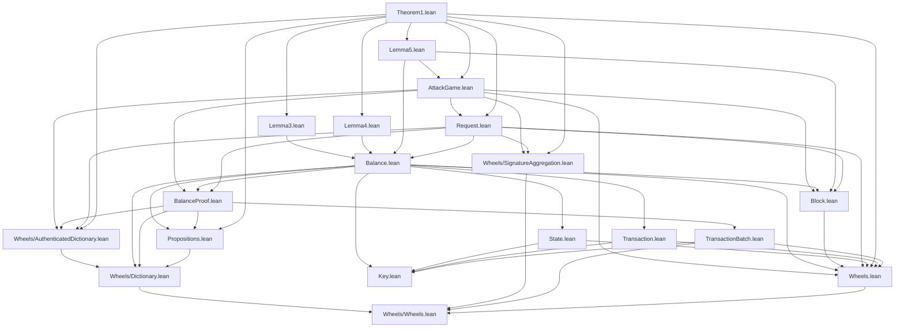

```mermaid
graph TD
  WAuthDict[Wheels/AuthenticatedDictionary.lean]
  WDict[Wheels/Dictionary.lean]
  WSigAgg[Wheels/SignatureAggregation.lean]
  WWheels[Wheels/Wheels.lean]
  AttackGame[AttackGame.lean]
  Balance[Balance.lean]
  BalanceProof[BalanceProof.lean]
  Block[Block.lean]
  Key[Key.lean]
  Lemma3[Lemma3.lean]
  Lemma4[Lemma4.lean]
  Lemma5[Lemma5.lean]
  Propositions[Propositions.lean]
  Request[Request.lean]
  State[State.lean]
  Theorem1[Theorem1.lean]
  Tx[Transaction.lean]
  TxBatch[TransactionBatch.lean]
  Wheels[Wheels.lean]

  %% subgraph Theorem
  %%   Theorem1
  %% end

  %% subgraph MetaLemma
  %%   AttackGame
  %%   Balance
  %%   Request
  %% end

  %% subgraph Axioms
  %%   WWheels
  %%   Key
  %% end

  %% WAuthDict
  WAuthDict --> WDict

  %% WDict
  WDict --> WWheels

  %% WSigAgg
  WSigAgg --> WWheels

  %% WWheels: none

  %% AttackGame
  AttackGame --> WAuthDict
  AttackGame --> WSigAgg
  AttackGame --> BalanceProof
  AttackGame --> Block
  AttackGame --> Request
  AttackGame --> Wheels

  %% Balance
  Balance --> BalanceProof
  Balance --> Block
  Balance --> Key
  Balance --> Propositions
  Balance --> State
  Balance --> Tx
  Balance --> Wheels
  Balance --> WDict

  %% BalanceProof
  BalanceProof --> Propositions
  BalanceProof --> TxBatch
  BalanceProof --> WAuthDict
  BalanceProof --> WDict

  %% Block
  Block --> Wheels

  %% Key: none

  %% Lemma3
  Lemma3 --> Balance

  %% Lemma4
  Lemma4 --> Balance

  %% Lemma5
  Lemma5 --> AttackGame
  Lemma5 --> Block
  Lemma5 --> Balance

  %% Propositions
  Propositions --> WDict

  %% Request
  Request --> Balance
  Request --> BalanceProof
  Request --> Block
  Request --> Wheels
  Request --> WAuthDict
  Request --> WSigAgg

  %% State
  State --> Key
  State --> Wheels

  %% Theorem1
  Theorem1 --> AttackGame
  Theorem1 --> Lemma3
  Theorem1 --> Lemma4
  Theorem1 --> Lemma5
  Theorem1 --> Propositions
  Theorem1 --> Request
  Theorem1 --> Wheels
  Theorem1 --> WAuthDict
  Theorem1 --> WSigAgg

  %% Tx
  Tx --> Key
  Tx --> Wheels

  %% TxBatch
  TxBatch --> Key
  TxBatch --> Wheels
  TxBatch --> WWheels

  %% Wheels
  Wheels --> WWheels
```
